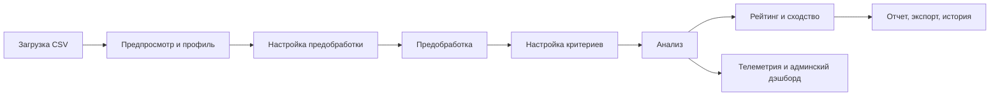

# Описание системы сравнительного анализа объектов

## 1. Назначение системы

Система предназначена для сравнительного анализа табличных данных. Она позволяет загружать датасеты, автоматически профилировать их, настраивать предобработку, задавать критерии сравнения и получать итоговый рейтинг объектов либо искать аналоги относительно целевого объекта. Результат расчета сопровождается пояснениями, отчетами, историей запусков и административной телеметрией.

Система особенно полезна в сценариях, где нужно:
- сравнивать объекты по набору разнородных признаков;
- вручную управлять кодированием категорий и правилами обработки данных;
- получать воспроизводимый и интерпретируемый результат;
- сохранять историю сценариев и повторно использовать сохраненные артефакты;
- наблюдать за работой системы через административный дэшборд.

## 2. Общая архитектура

Система состоит из двух основных частей:
- **Backend** на FastAPI и Python, который отвечает за загрузку, профилирование, предобработку, анализ, хранение истории и выдачу API.
- **Frontend** на React + TypeScript, который реализует полный пользовательский сценарий: от загрузки файла до просмотра отчета.

### 2.1 Основной цикл работы

1. Пользователь загружает CSV-файл.
2. Backend строит предпросмотр и профиль данных.
3. Пользователь настраивает типы полей, кодирование, обработку пропусков, выбросов и масштабирование.
4. Система выполняет предобработку и формирует подготовленный датасет.
5. Пользователь задает критерии сравнения, веса и направления.
6. Система запускает анализ.
7. Пользователь получает рейтинг, вклад критериев, устойчивость результата, отчет и экспорт.
8. Запуск и его параметры сохраняются в истории.

### 2.2 Архитектурная схема



## 3. Backend

### 3.1 Основной стек

Backend построен на:
- **FastAPI** — HTTP API и middleware;
- **Pydantic** — модели запросов и ответов;
- **SQLAlchemy** — работа с базой данных;
- **pandas / numpy** — обработка табличных данных и вычисления;
- **logging** — файловое и консольное логирование;
- **JWT** — аутентификация и авторизация.

### 3.2 Точка входа

Главная точка входа находится в `backend/app/main.py`. Там выполняются следующие действия:
- создается приложение FastAPI;
- подключается CORS;
- настраивается middleware для логирования запросов;
- регистрируются обработчики исключений;
- подключаются маршруты API;
- на старте приложения инициализируется база данных и создается администратор по умолчанию.

### 3.3 Основные backend-сервисы

#### 3.3.1 `preprocessing_engine.py`

Этот модуль отвечает за преобразование сырых строк в подготовленный набор данных.

Поддерживаемые функции:
- удаление дубликатов;
- обработка пропусков;
- удаление или обрезка выбросов;
- числовое нормирование;
- порядковое кодирование категорий;
- бинарное отображение значений;
- one-hot encoding;
- извлечение признаков из дат и времени;
- округление дробных значений;
- сохранение исходных значений при необходимости.

Особенности:
- данные обрабатываются в виде DataFrame;
- для one-hot encoding dummy-колонки объединяются через `pd.concat`, что снижает фрагментацию DataFrame;
- модуль возвращает не только готовый датасет, но и отчеты по каждому полю.

#### 3.3.2 `analysis_engine.py`

Этот модуль выполняет сравнительный анализ и строит итоговый рейтинг.

Функции:
- нормализация критериев;
- расчет взвешенного итогового балла;
- вычисление близости к целевому объекту в режиме поиска аналогов;
- построение рейтинга;
- расчет вклада каждого критерия;
- анализ устойчивости рейтинга;
- расчет чувствительности критериев;
- формирование групп аналогов;
- определение пар доминирования;
- формирование показателей доверия к результату.

#### 3.3.3 `pipeline_engine.py`

Это оркестратор всего процесса. Он связывает:
- загрузку и хранение файлов;
- построение профиля;
- запуск предобработки;
- запуск анализа;
- сохранение истории расчета;
- использование сохраненных артефактов для повторных запусков.

Дополнительно модуль:
- подготавливает данные для предпросмотра;
- применяет безопасные значения по умолчанию к конфигурации;
- формирует системный дэшборд.

#### 3.3.4 `dataset_artifact_service.py`

Сервис артефактов датасета отвечает за кеширование и повторное использование данных:
- артефакт предпросмотра исходного файла;
- артефакт предобработанного датасета;
- артефакт профиля предобработанного датасета.

Это ускоряет повторные запуски и позволяет работать в режиме stored без повторной загрузки файла.

#### 3.3.5 `profile_artifact_service.py`

Этот сервис строит профиль датасета, включая:
- распределения;
- статистику;
- вероятные выбросы;
- рекомендации по типам и предобработке;
- режимы краткого и подробного профилирования.

#### 3.3.6 `telemetry.py`

Телеметрия хранится в памяти и собирает:
- количество запросов;
- среднее время ответа;
- p95 по времени ответа;
- количество ошибок;
- данные по сервисам и маршрутам.

Эти данные используются в административном дэшборде.

### 3.4 API

Основные маршруты:

- `POST /api/v1/pipeline/preview` — предпросмотр CSV.
- `POST /api/v1/pipeline/upload-profile` — загрузка и профилирование файла.
- `POST /api/v1/pipeline/preprocess-refresh` — обновление предобработки по сохраненному датасету.
- `POST /api/v1/pipeline/run` — запуск анализа по загруженному файлу.
- `POST /api/v1/pipeline/run-stored` — запуск анализа по сохраненному артефакту.
- `POST /api/v1/pipeline/profile-stored` — получение профиля из сохраненного датасета.
- `GET /api/v1/system/dashboard` — системный дэшборд и телеметрия.
- `POST /api/v1/auth/login` — вход.
- `POST /api/v1/auth/register` — регистрация.

### 3.5 Авторизация и роли

Система использует JWT-токены. Пользователь может:
- зарегистрироваться;
- войти в систему;
- выполнять расчеты и сохранять историю;
- в роли администратора просматривать расширенную статистику и системный дэшборд.

### 3.6 Логирование и обработка ошибок

Backend ведет:
- журналирование запросов;
- аудитоподобные записи;
- ошибки middleware;
- структурированные JSON-ответы для HTTP-ошибок;
- записи в ротационный файл `./logs/backend.log`.

## 4. Frontend

### 4.1 Назначение

Frontend реализует всю пользовательскую логику работы с системой. Он позволяет:
- загружать датасет;
- смотреть профиль и предпросмотр;
- менять параметры предобработки;
- настраивать критерии;
- запускать расчет;
- просматривать результаты;
- скачивать отчет;
- смотреть историю;
- работать с административной панелью.

### 4.2 Основные файлы

- `frontend/src/App.tsx` — главный экран и вся логика workflow.
- `frontend/src/api.ts` — все вызовы backend API.
- `frontend/src/types.ts` — общие типы данных.
- `frontend/src/styles.css` — визуальные стили.

### 4.3 Сценарий работы интерфейса

Frontend построен как последовательность этапов:
- **Данные** — загрузка и предпросмотр.
- **Подготовка** — настройка типов, пропусков, выбросов, кодирования и масштабирования.
- **Критерии** — веса и направления.
- **Результаты** — рейтинг, вклад критериев, пояснения, отчет.
- **Админ** — телеметрия и системная статистика.

### 4.4 Возможности этапа предобработки

На этапе подготовки пользователь может:
- выбрать тип поля: числовой, целый, дробный, категориальный, бинарный, текстовый, дата/время;
- задать стратегию обработки пропусков;
- выбрать способ работы с выбросами;
- настроить кодирование;
- задать порядковую карту вручную;
- задать бинарную карту;
- выбрать метод нормализации;
- задать формат дат;
- указать точность округления для дробных значений;
- включать или исключать поля из выходного набора.

### 4.5 Логика критериев

При создании критериев система автоматически строит значения по полям, пригодным для анализа.

Поддерживаются:
- вес критерия;
- тип критерия;
- направление:
  - `maximize` — больше лучше;
  - `minimize` — меньше лучше;
  - `target` — ближе к целевому значению.

Если режим анализа переключается, значения направлений могут автоматически обновляться по умолчанию:
- для `rating` — `maximize`;
- для `analog_search` — `target`.

### 4.6 Отображение результатов

В разделе результатов доступны:
- столбчатая диаграмма рейтинга;
- постраничный просмотр;
- карточка выбранного объекта;
- таблица вкладов по критериям;
- анализ устойчивости рейтинга;
- чувствительность критериев;
- группы аналогов;
- доминирование объектов;
- построение HTML-отчета;
- экспорт полного отсортированного CSV.

### 4.7 Работа с отчетом

Отчет формируется на стороне клиента и включает:
- сводку по расчету;
- критерии и направления;
- вклад каждого критерия;
- итоговый рейтинг;
- пояснения и замечания;
- дополнительные блоки по устойчивости, аналогам и доминированию.

### 4.8 Административная панель

Администратор видит:
- общую статистику;
- список пользователей;
- системный дэшборд;
- телеметрию по запросам;
- среднее время ответа по модулям;
- p95-показатели;
- количество ошибок.

## 5. Форматы данных

### 5.1 Поля датасета

В конфигурации поля могут храниться:
- ключ колонки;
- тип поля;
- признак включения в выход;
- стратегия пропусков;
- стратегия выбросов;
- коэффициент для выбросов;
- нормализация;
- кодирование;
- карта порядкового кодирования;
- бинарная карта;
- точность округления;
- формат даты и времени.

### 5.2 Критерии

Критерий описывается через:
- `key`;
- `name`;
- `weight`;
- `type`;
- `direction`;
- `scale_map`.

### 5.3 Результат анализа

Результат обычно содержит:
- `ranking` — список объектов с местом, скором и вкладом критериев;
- `analysis_summary` — агрегированные показатели;
- `history_id` — идентификатор записи истории;
- пояснения и дополнительные блоки.

## 6. Особенности расчета

### 6.1 Режим `rating`

Используется для обычного ранжирования объектов. Итоговая оценка строится как взвешенная сумма нормализованных критериев.

### 6.2 Режим `analog_search`

Используется, когда есть целевой объект. Система ищет наиболее близкие аналоги и может вычислять `similarity_to_target`.

### 6.3 Устойчивость и чувствительность

Система оценивает:
- насколько стабилен лидер рейтинга;
- как меняется результат при вариации весов;
- насколько отдельные критерии влияют на итог;
- насколько результат надежен при текущем качестве данных.

## 7. Хранение и повторное использование

Система поддерживает:
- историю расчетов;
- проекты;
- сценарии;
- повторный запуск на сохраненных данных;
- сохраненные профили и предобработку.

Это полезно для:
- сравнения нескольких сценариев;
- воспроизведения результата;
- экономии времени при повторных расчетах.

## 8. Тестирование

### 8.1 Backend

Используется `pytest`. В проекте есть тесты на:
- предобработку;
- обработку API;
- сервис профилирования;
- телеметрию;
- контрактные части pipeline.

### 8.2 Frontend

Frontend собирается через Vite и TypeScript. Проверяется корректность сборки и типов.

### 8.3 Нагрузочная проверка

Есть облегченный smoke-load скрипт для быстрой проверки работы системы под небольшой нагрузкой.

## 9. Запуск

### 9.1 Backend

```powershell
Set-Location "c:\Users\Stepan\Documents\New project"
.venv\Scripts\Activate.ps1
python -m uvicorn backend.app.main:app --reload --port 8050
```

### 9.2 Frontend

```bash
cd frontend
npm install
npm run dev
```

### 9.3 Тесты

```powershell
Set-Location "c:\Users\Stepan\Documents\New project"
.venv\Scripts\Activate.ps1
python -m pytest -q
```

## 10. Наблюдаемость и эксплуатация

### 10.1 Логи

Логи backend пишутся в `./logs/backend.log`.

### 10.2 Телеметрия

Административный дэшборд показывает:
- средние времена ответа;
- количество запросов;
- ошибки;
- распределение по сервисам.

### 10.3 Полезные признаки для диагностики

Для отладки полезно смотреть:
- консоль браузера;
- ответ network-запроса на `/pipeline/run`;
- backend-логи;
- телеметрию в админке.

## 11. Ограничения и рекомендации

### 11.1 Ограничения

- In-memory телеметрия не переживает рестарт сервера.
- One-hot encoding при большом количестве категорий может значительно раздувать таблицу.
- Анализ зависит от качества конфигурации полей и критериев.
- При ошибочном формате ответа frontend может не отобразить результат корректно, поэтому контракт ответа важен.

### 11.2 Рекомендации

- Для числовых полей использовать `minmax` как базовый вариант.
- Для категорий с понятным порядком задавать ручную карту порядкового кодирования.
- Для `analog_search` всегда задавать целевой объект осознанно.
- Для больших датасетов использовать stored-режим и артефакты.
- Контролировать качество данных перед анализом.

## 12. Структура проекта

- `backend/` — backend-приложение.
- `frontend/` — frontend-приложение.
- `docs/` — документация.
- `scripts/` — служебные скрипты.
- `logs/` — журналы работы.
- `htmlcov/` — HTML-отчет покрытия тестами.

## 13. Краткий вывод

Система представляет собой полнофункциональную платформу сравнительного анализа данных с гибкой настройкой предобработки, интерпретируемым расчетом, отчетностью, историей и наблюдаемостью. Она подходит для отчетных, аналитических и исследовательских задач, где важны не только итоговые значения, но и объяснение того, как они были получены.
